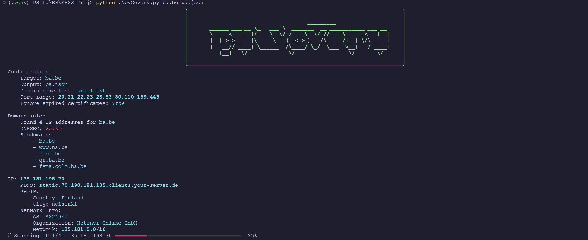

# Eindopdracht Ethical Hacking
Door Tom Goedemé

## Intro

Voor mijn eindopdracht Ethical Hacking heb ik ervoor gekozen om een OSINT-tool te ontwikkelen die helpt bij het identificeren en analyseren van kwetsbaarheden in hosts door middel van het verstrekken van een domeinnaam. Deze keuze is ontstaan tijdens mijn werkzaamheden bij BA onder leiding van Jan Guldentops, waar het uitvoeren van enumeratie op klantsystemen en het identificeren van mogelijke zwakke punten een cruciale taak was. Na overleg met de heer Michiels kreeg ik toestemming om dit als inspiratiebron te gebruiken voor mijn eindopdracht. Hierbij presenteer ik met trots pyCovery.

## pyCovery

pyCovery is een krachtige Python OSINT-tool die ontworpen is om uitgebreid informatie te verzamelen via een opgegeven domeinnaam. De tool doorloopt verschillende stappen om een grondige analyse uit te voeren.

### Gegevensverzameling

De tool begint bij het scannen van de opgegeven domein op subdomeinen met behulp van een bruteforce-dictionary en door het doorzoeken van crt.sh SSL-certificaten.

- **Domeinrecords:**
    Het programma verzamelt alle DNS-records van het opgegeven domein en de ontdekte subdomeinen. Dit omvat informatie zoals A-, AAAA-, TXT, MX-records.

- **IP-gegevens:**
    De geïdentificeerde IP-adressen worden uitgebreid gescand. Dit omvat het verkrijgen van de Reverse DNS-naam, GeoIP-informatie (land en stad), en netwerkinformatie zoals ASN, organisatie en netwerkgrootte.

- **Poort- en servicescan:**
    Voor elk gevonden IP-adres voert het programma een poortscan uit. Hierbij worden open poorten geïdentificeerd, samen met informatie over de draaiende services en hun versies.

- **SSH-serveranalyse:**
    Op gevonden SSH-servers wordt gecontroleerd of er zwakke algoritmes worden gebruikt, waardoor de tool ook kan helpen bij het identificeren van mogelijke beveiligingszwaktes op SSH-gebaseerde systemen.
  
- **Resultatenopslag:**
    De tool slaat alle verzamelde gegevens op in een aanpasbaar JSON-bestand. Deze aanpak biedt de gebruiker flexibiliteit om de resultaten op een later tijdstip te analyseren op een manier die aan hun behoeften voldoet. Het gebruik van een JSON-bestand vergemakkelijkt ook verdere verwerking en maakt het mogelijk om de gegevens eenvoudig te delen of te importeren in andere tools en platforms.

- **Rich Progressbar:**
Tijdens het scannen van de IP-adressen wordt een Rich progress bar weergegeven. Dit is van cruciaal belang, gezien de variabele duur van de gekozen scans. De progress bar biedt gebruikers een visuele indicatie van de voortgang en de geschatte tijd tot voltooiing, waardoor ze een beter begrip krijgen van de tijdsduur van het programma.

pyCovery biedt een uitgebreide en gestructureerde aanpak voor domeinanalyse en is ideaal voor gebruikers die gedetailleerde informatie willen verkrijgen van een bepaald domein.

## Requirements

- Python 3.9
- Vereiste bibliotheken (geïnstalleerd vanuit het bijgeleverde requirements.txt-bestand)
- Nmap
- (Optioneel) MaxMind-databases voor ASN & City in mmdb-formaat
- (Optioneel) het word hard aanbevolen gebruik te maken van een virtual environment in Python

## Gebruik

De tool kan aangeroepen worden via minimaal het volgende commando:
`pyCovery.py ap.be ap.json`
Waarbij `ap.be` het domein is dat dat gescant moet worden en `ap.json` de gewenste bestandslocatie is voor het wegschrijven van het json bestand.

Er word gebruik gemaakt van bepaald configuratie die op 2 manieren kan ingesteld worden. De volgorde van prioriteit is:
1) **CLI-argumenten**: Configuratie kan direct worden opgegeven via de opdrachtregel.
2) **Configuratiebestand (config.py)**: Configuratiewaarden kunnen ook permanent worden ingesteld in het config.py-bestand.

Deze dubbele configuratiemogelijkheden bieden flexibiliteit. Basisinstellingen kunnen eenvoudig worden gewijzigd via het configuratiebestand, terwijl er ook gemakkelijk eenmalige afwijkingen mogelijk zijn via de opdrachtregel.

### CLI-argumenten overzicht

```
usage: pyCovery.py [-h] [-d DOMAINNAME_LIST] [-p PORTRANGE] [-l] domain output

Cybersecurity scanning CLI tool

positional arguments:
  domain                Domain to scan
  output                Output JSON file path

options:
  -h, --help            show this help message and exit
  -d DOMAINNAME_LIST, --domainname_list DOMAINNAME_LIST
                        List of domain names to use for subdomain brute forcing
  -p PORTRANGE, --portrange PORTRANGE
                        Port range to scan
  -l, --lookup_expired  Do not ignore expired certificates from crt.sh
```

### Config.py overzicht

| Variable | Uitleg |
| - | - |
| domainname_list | Het bestand dat wordt gebruikt voor subdomeinen bij het uitvoeren van een brute force-aanval. |
| portrange | De te scannen poortreeks, gespecificeerd als een komma-gescheiden lijst (bijv. 10,20) of bereik (bijv. 20-30). |
| crt_sh_ignore_expired | Bepaalt of verlopen SSL-certificaten worden gebruikt bij het ontdekken van domeinen via crt.sh. |
| geoip_city_path | Het pad naar het GeoLite2 City-databasebestand van Maxmind. Laat leeg om deze module uit te schakelen. |
| geoip_asn_path | Het pad naar het GeoLite2 ASN-databasebestand van Maxmind. Laat leeg om deze module uit te schakelen. |
| ssh_server_identifiers | (Geavanceerd) Nmap-service-identifiers voor SSH-servers. |
| unsafe_ssh_algorithms | (Geavanceerd) Lijst van zwakke SSH-algoritmen. |
```
class Config:
    domainname_list = "small.txt"  # File containing domain names to use for subdomain brute forcing
    portrange = "20,21,22,23,25,53,80,110,139,443"  # Port range to scan
    crt_sh_ignore_expired = True  # Set to True to ignore expired certificates
    geoip_city_path = "GeoLite2-City.mmdb"  # Set empty string to disable GeoIP
    geoip_asn_path = "GeoLite2-ASN.mmdb"  # Set empty string to disable GeoIP

    ssh_server_identifiers = [  # Identifiers used to identify a SSH server
        "ssh",
        "openssh",
        "dropbear",
        "bitvise-ssh",
        "microsft-ssh",
    ]

    unsafe_ssh_algorithms = {  # This list is used by checking the start of the string
        "kex_algorithms": [
            "diffie-hellman-group-exchange-sha1",
            "diffie-hellman-group1-sha1",
            "diffie-hellman-group14-sha1",
            "gss-",
            "rsa1024-sha1",
        ],
        "encryption_algorithms": [
            "3des-cbc",
            "arcfour",
            "aes128-cbc",
            "aes192-cbc",
            "aes256-cbc",
            "blowfish-cbc",
            "cast128-cbc",
            "des-cbc",
            "des-ede",
            "idea-cbc",
            "rc4",
        ],
        "mac_algorithms": ["hmac-md5", "hmac-sha1", "umac-64", "hmac-ripemd160", "umac-128-etm"],
        "server_host_key_algorithms": ["ssh-dss", "ssh-rsa"],
    }
```


## Reflectie

Tijdens het ontwikkelen van dit programma ben ik regelmatig opnieuw begonnen. In het begin had ik weliswaar een duidelijk idee van wat ik wilde bereiken met mijn opdracht, maar het ontbrak me aan een helder beeld van hoe ik dit het beste kon implementeren. Dit leidde tot herhaalde iteraties, vooral bij het gebruik van Flask. Mijn drang naar perfectie bracht me soms in een situatie waarin ik te veel gefixeerd was op het streven naar perfectie.

Ik ontdekte dat mijn oorspronkelijke focus op het gebruik van de tool in bugbounties mijn denkproces beïnvloedde en me beperkte in mijn mogelijkheden. Door deze focus los te laten en me meer te richten op OSINT kreeg ik een duidelijker beeld van het doel van mijn project, waardoor ik verder kon gaan met meer duidelijkheid en richting. Het proces van herhaalde iteraties en het loslaten van bepaalde ideeën heeft me uiteindelijk geholpen om betere beslissingen te nemen en tot een effectievere implementatie te komen.

Uiteindelijk heb ik gekozen voor een CLI-versie. Het loggen naar een JSON-bestand maakt het eenvoudig om later analyses uit te voeren. Bij het ontwikkelen van de scans besteedde ik veel tijd aan het handmatig implementeren van de SSH-algoritme scan.

Als mogelijke verbeteringen in het programma zou ik het graag uitbreiden met meer scans, hierbij denk ik dan aan SSL algoritme checks en HTTP(S) Header checks.

## Voorbeelden

### Cli



### JSON output

Als voorbeeld json output is het bestand [ba.json](./ba.json) meegegeven.

### Subdomein wordlist

Er is ook een heel kleine subdomein wordlist [small.txt](./small.txt) meegeven als proof of concept.
